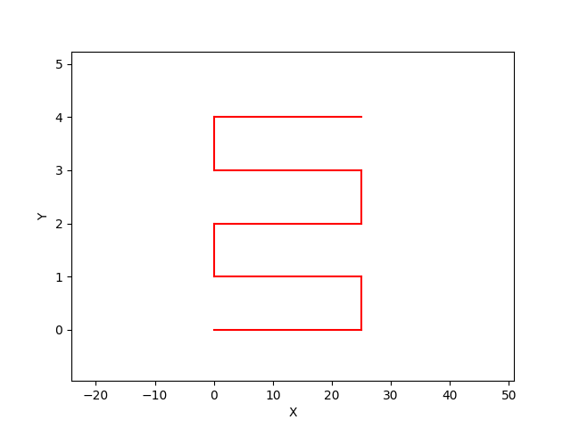
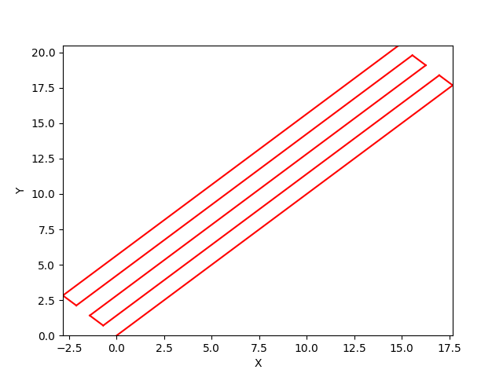

## Matrix Transforms

A wrapper class, [GMatrix](../api-reference/mecode.md/#mecode.main.G) will run all move and arc commands through a 
2D transformation matrix before forwarding them to `G`.

To use, simply instantiate a `GMatrix` object instead of a `G` object:

```python
# Replace this line 
#   from mecode import G
# with this one
from mecode import GMatrix
import numpy as np

g = GMatrix()

# set print speed
g.feed(1)

g.toggle_pressure(1)

# save the current transformation matrix on the stack.
g.push_matrix()

# rotate our transformation matrix by 45 degrees.
g.rotate(np.pi/4)

# generate a serpentine path of length 25 mm, 5 lines, and 1 mm spacing
g.serpentine(25, 5, 1, color=(1,0,0))

# revert to the prior transformation matrix.
g.pop_matrix()

g.toggle_pressure(1)

g.teardown()

g.view('2d')
```


!!! Note "The transformation matrix is 2D instead of 3D to simplify arc support."

??? example "Generated gcode"

    ```
    Running mecode v0.2.38
    G1 F1
    Call togglePress P1
    G1 X17.677670 Y17.677670
    G1 X-0.707107 Y0.707107
    G1 X-17.677670 Y-17.677670
    G1 X-0.707107 Y0.707107
    G1 X17.677670 Y17.677670
    G1 X-0.707107 Y0.707107
    G1 X-17.677670 Y-17.677670
    G1 X-0.707107 Y0.707107
    G1 X17.677670 Y17.677670
    Call togglePress P1

    Approximate print time: 
            129.000 seconds 
            2.1 min 
            0.0 hrs
    ```
### **Result**: before rotating by 45 degrees
{width="300" }

### **Result**: after rotation transformation
{width="300" }