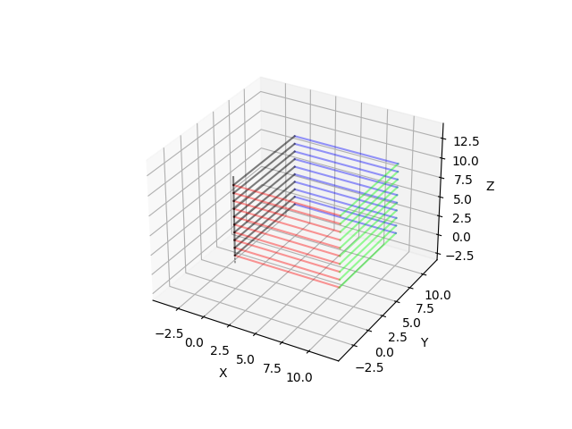

## Example: hollow box

```python

from mecode import G

g = G()

# define box side length
L = 10 # mm

# number of layers to print 
n_layers = 10

# spacing between layers
dz = 1

# set print speed in mm/s
g.feed(10)

# move nozzle to initial printing height
g.move(z=dz)

# create a list of rgba colors to showcase `color` support in `view()`
colors = [(1,0,0,0.4), (0,1,0,0.4), (0,0,1,0.4),(0,0,0,0.5)]

# turn pressure on (e.g., to start printing)
g.toggle_pressure(com_port=5)

# generate print path
for j in range(n_layers):
    # move from (0,0) to (L,0)
    g.move(x=L, color=colors[0])

    # move from (L,0) to (L,L)
    g.move(y=L, color=colors[1])

    # move from (L,L) to (0,L)
    g.move(x=-L, color=colors[2])

    # move from (0,L) to (0,0)
    g.move(y=-L, color=colors[3])

    g.move(z=dz)

# turn pressure off (e.g., to stop printing)
g.toggle_pressure(com_port=5) 

g.teardown()

g.view()

```

??? example "Generated gcode"

    ```
    Running mecode v0.2.38
    
    G1 F10
    G1 Z1.000000
    Call togglePress P5
    G1 X10.000000
    G1 Y10.000000
    G1 X-10.000000
    G1 Y-10.000000
    G1 Z1.000000
    G1 X10.000000
    G1 Y10.000000
    G1 X-10.000000
    G1 Y-10.000000
    G1 Z1.000000
    G1 X10.000000
    G1 Y10.000000
    G1 X-10.000000
    G1 Y-10.000000
    G1 Z1.000000
    G1 X10.000000
    G1 Y10.000000
    G1 X-10.000000
    G1 Y-10.000000
    G1 Z1.000000
    G1 X10.000000
    G1 Y10.000000
    G1 X-10.000000
    G1 Y-10.000000
    G1 Z1.000000
    G1 X10.000000
    G1 Y10.000000
    G1 X-10.000000
    G1 Y-10.000000
    G1 Z1.000000
    G1 X10.000000
    G1 Y10.000000
    G1 X-10.000000
    G1 Y-10.000000
    G1 Z1.000000
    G1 X10.000000
    G1 Y10.000000
    G1 X-10.000000
    G1 Y-10.000000
    G1 Z1.000000
    G1 X10.000000
    G1 Y10.000000
    G1 X-10.000000
    G1 Y-10.000000
    G1 Z1.000000
    G1 X10.000000
    G1 Y10.000000
    G1 X-10.000000
    G1 Y-10.000000
    G1 Z1.000000
    Call togglePress P5

    Approximate print time: 
            55.299 seconds 
            0.9 min 
            0.0 hrs
    ```

