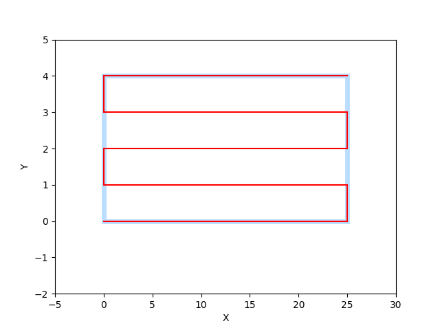
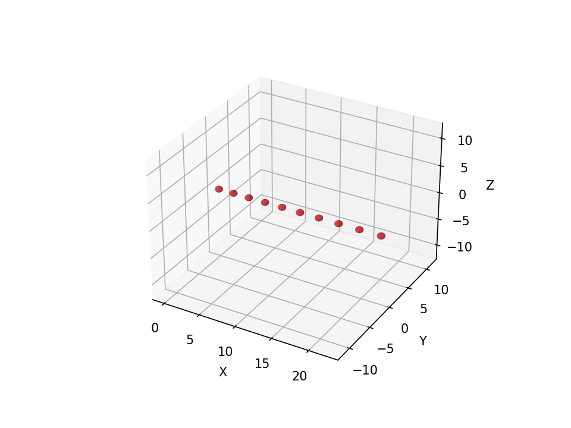

## Example: using matplotlib axes to extend plotting capabilities

By passing an `axes` handle to [`view()`](api-reference/mecode.md/#mecode.main.G.view) you can take advantage of all plotting features from [matplotlib](https://matplotlib.org).

```python
from mecode import G
import numpy as np
import matplotlib.pyplot as plt
from matplotlib.patches import Rectangle

g = G()

g.feed(1)

g.toggle_pressure(1)
g.serpentine(25, 5, 1, color=(1,0,0))
g.toggle_pressure(1)

g.teardown()

fig, ax = plt.subplots()
ax = g.view('2d', ax=ax)
ax.set_xlim(-5, 30)
ax.set_ylim(-2, 5)
ax.add_patch(Rectangle(
    (0,0), 25, (5-1)*1, lw=5, ec='dodgerblue', fc='none',  alpha=0.3)
    )
plt.show()
```


??? example "Generated Gcode"

    ```
    Running mecode v0.2.38
    G1 F1
    Call togglePress P1
    G1 X25.000000
    G1 Y1.000000
    G1 X-25.000000
    G1 Y1.000000
    G1 X25.000000
    G1 Y1.000000
    G1 X-25.000000
    G1 Y1.000000
    G1 X25.000000
    Call togglePress P1

    Approximate print time: 
            177.637 seconds 
            3.0 min 
            0.0 hrs
    ```

### Result: example using matplotlib patches.Rectangle 


## Example: printing droplets
```python
    from mecode import G
    import numpy as np
    import matplotlib.pyplot as plt
    from matplotlib.patches import Rectangle

    g = G()
    g.feed(10)

    for j in range(10):
        g.toggle_pressure(5) # ON
        g.move(x=+j/10, color=(1,0,0))
        g.toggle_pressure(5) # OFF
        g.move(x=2)

    g.teardown()

    g.view('3d', shape='droplet', radius=0.5)

```

??? example "Generated Gcode"

    ```
    G91
    G1 F10
    Call togglePress P5
    G1 X0.000000
    Call togglePress P5
    G1 X2.000000
    Call togglePress P5
    G1 X0.100000
    Call togglePress P5
    G1 X2.000000
    Call togglePress P5
    G1 X0.200000
    Call togglePress P5
    G1 X2.000000
    Call togglePress P5
    G1 X0.300000
    Call togglePress P5
    G1 X2.000000
    Call togglePress P5
    G1 X0.400000
    Call togglePress P5
    G1 X2.000000
    Call togglePress P5
    G1 X0.500000
    Call togglePress P5
    G1 X2.000000
    Call togglePress P5
    G1 X0.600000
    Call togglePress P5
    G1 X2.000000
    Call togglePress P5
    G1 X0.700000
    Call togglePress P5
    G1 X2.000000
    Call togglePress P5
    G1 X0.800000
    Call togglePress P5
    G1 X2.000000
    Call togglePress P5
    G1 X0.900000
    Call togglePress P5
    G1 X2.000000

    ; Approximate print time:
    ;       2.450 seconds
    ;       0.0 min
    ;       0.0 hrs
    ```
### Result
